# VecRepV3
Tools to convert images into vector representations in a vector space with specified properties

This README serves as a general overview of what we are attempting to do and gives context to the code written. Specific instructions on how the code is structured and how to use it can be found in the documentation file

# Quickstart
To use the code, run the VecRep.py file with your choice of image type, image filters, image product, and embedding type.

More detailed explanation of the options can be found under the "Generalised Problems" section. 

Note that an Octave installation is required to run certain functions. 
# Goals of intern project
The first goal of the project is to create a **vectorisation function** that maps a 2 by 2 **image** of 1s and 0s to an **N-Dimensional unit vector** (called a **vector embedding**), such that the dot product between any two such vector embeddings is equal to the **NCC score** between the two original 2 by 2 images.

### Motivation

Given such a function, it would be possible to convert any input image into a vector embedding, even a completely new image the functions has never seen before.

Clustering or classification can then be easily carried out on the vector embeddings. 

# NCC Score

## Definition

TODO this is confusing. Need more examples and demos

The NCC (Normalisation Cross Correlation) score between 2 images is defined as the *max value obtained after performing a template matching between one image and another.* For more details see [here](https://docs.opencv.org/3.4/d4/dc6/tutorial_py_template_matching.html).

Normally the template image given has to be smaller than the main image, so that the template is able to slide across the main image. However our template image is the same size as our main image. Our solution to this is to pad the main image with copies of itself.

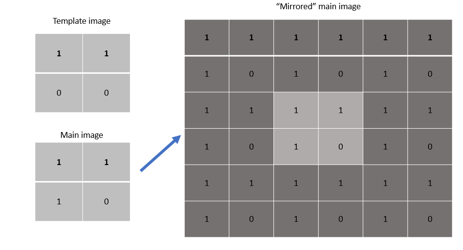

## Properties

More important than the exact process of finding the NCC score are the properties that the NCC score has. The 3 important properties of the function are

1. Commutative
2. Range of [0,1]
3. Scalar representation of similarity

### Commutative

The NCC score between 2 images is commutative, i.e. The NCC score with image A as the main image and image B as the template image, is the same as the NCC score if image B is the main image and image A is the template

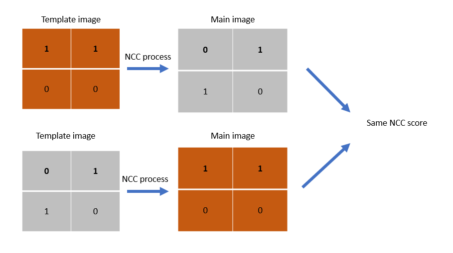

### Range of [0,1]

The maximum value of the NCC score is 1, and the minimum value is 0.

### Scalar representation of similarity

The NCC score will be high if the images are similar, and will have a maximum score of 1 if the 2 input images are identical or a simple translation of each other.

If the images are dissimilar, the NCC score will be lower.

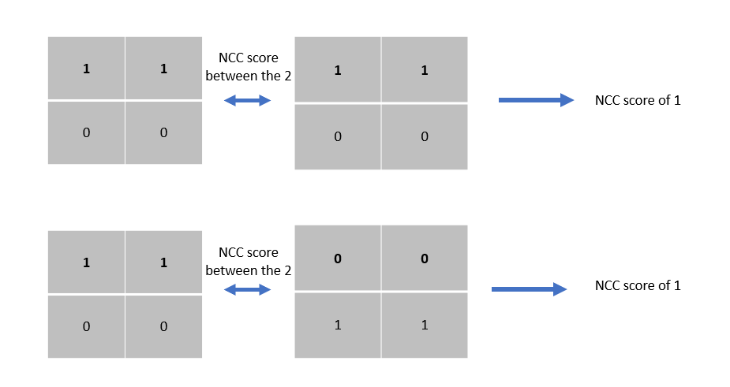

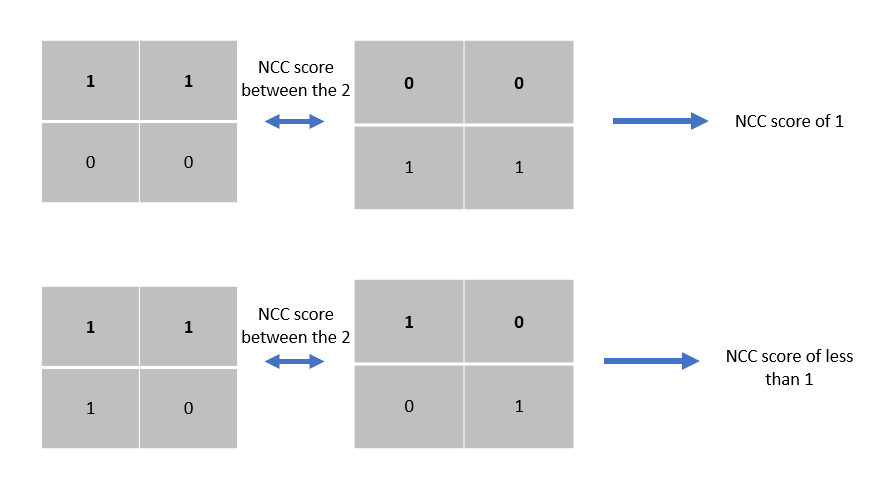
## Duality with dot products

These 3 above characteristics are similar to that of dot products between unit vectors

### Commutative

### Range of [-1,1]

### Scalar representation of similarity

Unit vector which have a low angular distance will have a high dot product and unit vectors with a high angular distance will have low dot product

## Vector embeddings and the embedding function
With these similarities, our goal is to find a *function* to map images into *unit vectors* such that that their dot product is equal to their NCC score. 

We define these unit vectors as the **vector embeddings** of the image.

We define this function we are attempting to find as the **embedding function**.

# Brute force approach
## Overview of approach
Since the number of possible 2x2 binary grids is small, we will first attempt a brute force (BF) approach where we numerically solve for the correct vector embedding for **every** possible image before hand.

These vector embeddings will be stored in a dictionary, with the images they represent as keys

When our embedding function takes in a new image, it then looks inside the dictionary and finds which vector embedding has this new image as a key. 

## Translationally unique squares

For a 2x2 grid of binary numbers, there are 16 possible images

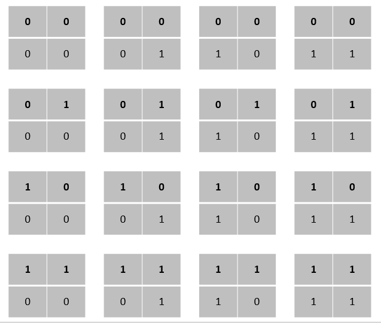

In an ideal scenario, images which are simple translations of each other should be represented by the same vector. This is because the NCC scores between the images would be 1, and hence the dot product between their vector embeddings will also equal to 1.

As a result, in our dictionary we can put an image and its all possible translations as the key for a vector embedding.

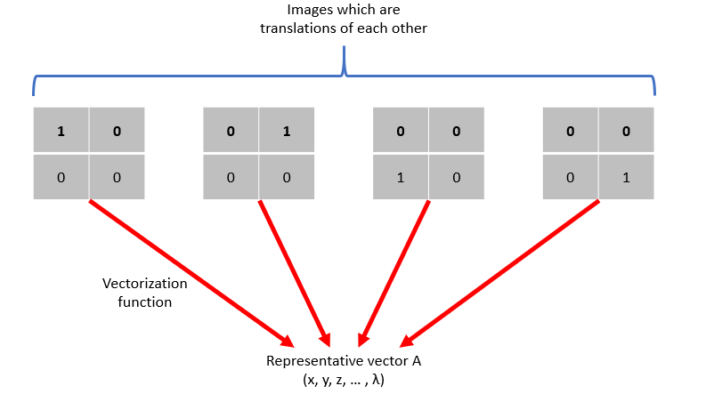

Hence, we would only like to consider the set of images which are not simple translations of each other. We find only 7 of such images.

Given that there are only 7 "unique" images, this means that our function has to produce exactly 7 different vectors for 16 inputs (Multiple squares map to the same vector). Given our constraints this also means that in general the vectors must have 7 dimensions. [^1] 

## Embedding matrix

Lets define matrix Am as a matrix with its columns corresponding to the 7 vector embeddings we wish to find. This matrix Am will also be called the **embedding matrix**

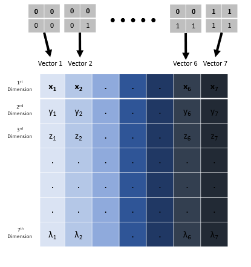

## Image product matrix
Lets also define matrix G as a matrix containing a table of image products between each image. This matrix G will also be called the **image product matrix**

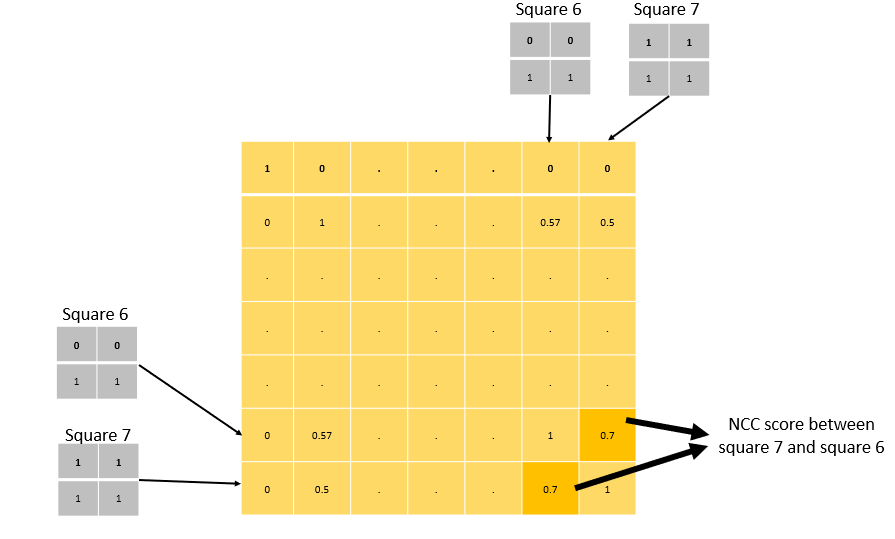

Recall that we wish to have the dot products of the vector embeddings to be equal to the NCC score between the respective images. 

[i.e. x1x2 + y1y2 + z1z2 + ... + λ1λ2 = NCC score(image 1, image 2)]
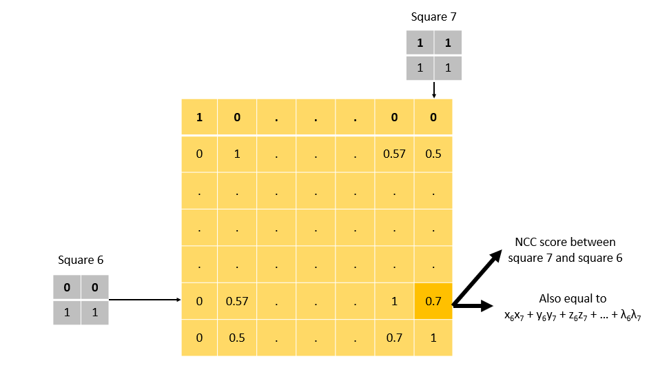

Notice that matrix A transposed multiplied by matrix A exactly equals matrix G. 
(AtA = G)
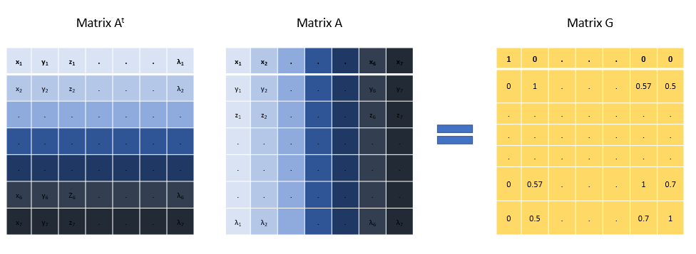

## Decomposition

We are able to find matrix G by simply computing the NCC score between all possible 2x2 images [^2]

There are various methods to find matrix A here given matrix G. One example is the [Cholesky decomposition](https://en.wikipedia.org/wiki/Cholesky_decomposition). We use the following method, which makes use of the fact that matrix G is a symmetric matrix.

  (Diagonalize the matrix, note Pt = P-1 as G is symmetric)

(D^{0.5}P^{-1}))

^t(D^{0.5}P^{-1}))

^t(D^{0.5}P^{t}))

Since we need to take the square root of D, the solution only works if matrix G has no negative eigenvalues (i.e. matrix G is positive semi-definite). We can show that if matrix B is not positive semi-definite, there exists no matrix A (containing only real numbers).

Suppose there exists a matrix A such that 

Consider the expression , where λ is an eigenvalue of matrix G and v it's corresponding eigenvector

 

Hence 

As such, given that there exists a embedding matrix that perfectly satisfies the NCC score requirement, the eigenvalues of matrix G must positive or zero. (i.e. matrix G is positive semi-definite)

In such a case, we are able to calculate  to obtain all the vector embeddings for the images.

## Cases where matrix G is not positive semi-definite

However, it is often the case that matrix G is not positive semi-definite. As such, we have to find methods to transform matrix G into a positive semi-definite matrix, while minimising the error incurred.

### Zeroing eigenvectors
This is not the main option for creating the matrix G'. The main option is detailed in [Pencorr](https://github.com/WhangShihEe/VecRepV3/tree/master/src/matlab_functions)

The first option is to just ceiling all the negative eigenvalues in the diagonal matrix D to zero, then calculate 

The issue with this approach is that the unit vector constraint is not preserved. In the previous approach the unit vector constraint was preserved by the diagonal of ones in the image product matrix. However after the negative eigenvectors are zeroed, the diagonal entries will not longer be equal to one.

This can be remedied by normalising the embedding vectors again, though this might result in deviation of G' from G.

### Nearest correlation matrix

A matrix which is positive semi-definite with unit diagonals is called a correlation matrix. Finding the nearest correlation matrix, while minimising the error is a [studied problem](https://nhigham.com/2013/02/13/the-nearest-correlation-matrix/). 

We can use these algorithms to find G' while maintaining the unit vector constraint. The matrix can then be decomposed using the above method

## Reducing the rank of G

While vector embeddings of 7 dimensions are needed in general to perfectly solve the problem, lower dimensionality is important for scalability.

As such we would like to have methods which are able to obtain vectors with fewer dimensions, while minimising the impact of the results, especially for the closest neighbours of an image.

We define Ad, n as the embedding matrix with reduced dimensions, such that there are n vector embeddings which only have d dimensions. Ad, n is a d by n matrix.

For instance, Ad=5, n=7 would be 5 by 7 matrix, where 7 is the number of vectors and 5 is the number of dimensions of the vector embedding.

### Reduced rank decomposition 
Given an n by n matrix G which only has d non-zero positive eigenvalues, it is possible to decompose it to a matrix Ad, n such that 

  (Diagonalize the matrix, note Pt = P-1 as G is symmetric)

Sort the eigenvalues in D and their corresponding eigenvectors in P in descending order, note that all values other than the top M diagonals are zero.

D can be written as a matrix multiplication of Droott and Droot, where Droot is an M by N matrix with the diagonal entries being the square root of the eigenvalues

^tD_{root}P^{-1})

^tD_{root}P^{t})

### Zeroing eigenvectors

Similar to the method above for dealing with negative eigenvalues, instead of just zeroing the negative eigenvalues, we now zero all but the largest N vectors.

The resulting matrix then can be decomposed using the reduced dimension decomposition

### Nearest correlation matrix with rank constraint

There are also methods to find the nearest correlation matrix with a rank constraint, such that the resulting matrix G' has only d non zero eigenvalues

The resulting matrix then can be decomposed using the reduced dimension decomposition

# Lagrangian Method

## Estimation of vector embedding
We wish to estimate a vector $x$, the reduced dimension vector embedding of one of the images not in $A$ that we randomly pick. This x will be the estimation of the vector embedding of the image.
 
 ## Obtaining $x$
Having decomposed the Matrix G' into 

and obtaining the value of $A_{d,n}$, we are able to minimise the error $\frac{1}{2}||A^tx-b||^2_2$ , 
Define $b$ as the image products between the picked image and the images in A. We also need to ensure that $x^tx = 1$ as the image product of an image with itself should be 1.

**The problem statement**

### Using Lagrange Multipliers 

=\frac{1}{2}||A^tx-b||^2_2&plus;\frac{1}{2}\lambda(||x||^2_2-1)\newline&space;0=\nabla\mathcal{L}(x,\lambda)=A(A^tx-b)&plus;\lambda&space;x\hspace{8.5mm}(1)\newline&space;x^tx=1\hspace{54.2mm}(2))

From above, $A = \sqrt{D}P^t$:

^t=\sqrt{D}P^tP\sqrt{D}=\sqrt{D}I\sqrt{D}=D)

From (1), 

x=Ab\newline(D&plus;\lambda&space;I)x=Ab\newline&space;x=(D&plus;\lambda&space;I)^{-1}Ab)

From (2), 

^{-1}Ab]^t[(D&plus;\lambda&space;I)^{-1}Ab]\qquad\newline\hspace{2.5mm}=b^tA^t(D&plus;\lambda&space;I)^{-1}(D&plus;\lambda&space;I)^{-1}Ab\newline\hspace{-1mm}=b^tA^t(D&plus;\lambda&space;I)^{-2}Ab\qquad\qquad\newline=y^t(D&plus;\lambda&space;I)^{-2}y\qquad(Let\hspace{1mm}y=Ab)\newline\implies&space;1=\sum_{i=1}^{n}\left(\frac{y_i}{D_{i,i}&plus;\lambda}\right)^2)

We will thereafter solve for the lagrangian multipliers using numerical methods provided by scipy, and find the x that minimises $\frac{1}{2}||Ax-b||^2_2$. 

# Metrics for embeddings
Since it is not possible to perfectly solve the problem, we would like to come up with metrics to compare different set of vector embeddings to choose the estimate that best satisfies our requirements.

## K neighbour score
Ideally, close neighbours of the vector embeddings should correspond to close neighbours the original image. The K neighbour score is the fraction of the K most similar images (i.e. highest image product) in K closest vector embeddings (i.e. highest dot product) for the corresponding vector. In an ideal case, the score would be one.

Note that this score only cares how many of the original closest neighbours remain as the closest neighbours. The order within the closest neighbours does not matter (we can make it matter though).

## K nearest neighbours algorithm 
Let the **image products** be b, and the **image product function** be f, 
s is any random image that is chosen, and n is the total number of images.
For example, for the image product table of 3x3 binary unique images, 
n = 64, and if we pick an image s = 20,   

$$b = [f(Image \ 1, Image\  s), f(Image\  2, Image\  s), ..., f(Image\  n, Image \ s)$$

Note that $f(Image \ i, Image \ i) = 1$.

Let x be the **estimated vector embedding**, and $A_i$ be the **vector representation of the image**. The dot product vector is defined as c, where
$$c = [ A_1.x, A_2.x, ... , A_n.x]  $$

Let k be the **nearest neighbour score**, where we track the k nearest neighbours to our vector x that represents image s. In vectors b and c, if k = 3, we will find the top 3 highest values and store their indices in a list.

For example let n = 5 and s = 3 and k = 2, an example vector b can be 
$$b = [0.988, 0.745, 1, 0.303, 0.812]$$
The two highest values (and thus 2 nearest neighbours) excluding s = 3 are at positions 1 and 5. Therefore the set of nearest neighbours will be in the form of $b_{neighbours} = (1,5)$

An example vector c can be 
$$c = [0.455, 0.325, 1, 0.983, 0.812]$$
Accordingly its nearest neighbours are $c_{neighbours} = (4,5)$

Using the formula of $k_{score} = (b_{neighbours} \cap c_{neighbours})  / k$,  in this case the k score will 0.5.

Using another example, if for the same values of n, s and k,
$$b = [0.988, 0.745, 1, 0.812, 0.812]$$
the nearest neighours will be (1,,4,5), as b[4] and b[5] have the same values.

Using this $k_{score}$, we will be able to plot out the consistency of nearest neighbours in a graph.

### Plotting of graphs
Using the data that we have obtained, we are able to plot a number of graphs that will allow us to see how the data correlates to one another. The details of the graphs can be found under [visualisations](https://github.com/WhangShihEe/VecRepV3/tree/jed/src/visualization/README.md).

# Sampling approach

## Overview of approach

While the BF approach may be able to find vector embeddings, it is not scalable and requires exhaustively calculating vectors for all possible images.

A more scalable approach would be to first get a small sample the total image set and calculate the vector embeddings for these images using the BF approach. Then a vector embedding for a new image can be calculated from the sampled image set.

## Notation

The subset of images from the original image set will be a random sample of n images. This subset will be called the **sampled image set**. 

The image product matrix computed using this sample image set will be called **matrix Gn** where n is the size of the sampled image set.

The vector embeddings for the sampled image set can then be calculated using the brute force approach. The matrix with its columns corresponding to the sampled vector embeddings will be called the **sampled embedding matrix or matrix Ad,n**, where d is the number of dimensions chosen for the vector embeddings and n is the size of the sampled image set and . Note that matrix Ad,n will be an m by n matrix.

## Preparing the sample set

First, the size of the sample set will be chosen to be some n, where n is less than the total size of the image set.

A random sample of n images from the original image set will be chosen, and their image product will be computed to obtain matrix Gn.

Next the dimensionality of the embedding vectors will be chosen to be some d.

Matrix Gn will undergo a rank reduction to obtain matrix G'n followed by a decomposition, to obtain the sampled embedding matrix, Ad,n

## Vectorising new images

The **image product vector** of an image will be defined as an n by 1 matrix, where the first entry corresponds to the image product score between the first sample image, the second entry the second image and so on.
 
When a new image is obtained, it's image product will be computed with each of the images in the sample to obtain an image product vector.

Note that the **vector embedding** of the new image will be d by 1 matrix

Note that the result of the matrix multiplication between the transposed vector embedding of the new image and matrix Ad,nt should be equal to the image product vector in an ideal case

## Minimising error

# Generalised problem

While we are investigating a toy problem, ideally we would like to build our code in mind for future extensions, for example using a more realistic image datasets. Hence, we define a few terms to find a more general solution to the problem.

## Image products
There is nothing special in particular about the NCC score. Any function which has the 3 properties above would be suitable. The NCC score was chosen as a relatively simple function to investigate.

While we will continue working with NCC, we define the term **Image product** to be a function which **takes in 2 images, and outputs a scalar, with the scalar satisfying the above 3 properties** (Commutative, range bounded to [-1,1] and being a scalar representation of similarity)

Currently, our list of implemented image products are:

1. NCC score
 
## Images

We would also want to work with larger images in the future. While the toy example uses 2x2 binary grids, we would hope to work with NxN grids which can contain any number. 

A 2D array that serves as an input to a image product will be called an **image**. This initial choice of input type will be defined as the **image type** of the problem. 

Currently, our list of implemented images types are:
1. Nbin: N by N binary squares
2. Nbin_MmaxOnes: N by N binary squares, with M% of the s

## Filters
While its possible to enumerate all possible binary images for small values of N, the total number of possible images increases exponentially with N. As such, we would want certain **filters** to reduce the size of the total image set, leaving only images which are less noisy to investigate.

A function which takes in a set of images, and outputs a subset of those images based on a certain criteria will be called a **filter**

Currently, our list of implemented images types are:
1. one_island: Outputs a set of images such that each image has only one connected island of 1s (Diagonals are not connected)
2. Pmax_ones: Outputs a set of images such that each image has only P or lower percentage of 1s (etc. only up to 50% of the squares can be 1s)
3. translationally_unique: Outputs a set of images such that each image is NOT a simple translation of another image in the set [^3]

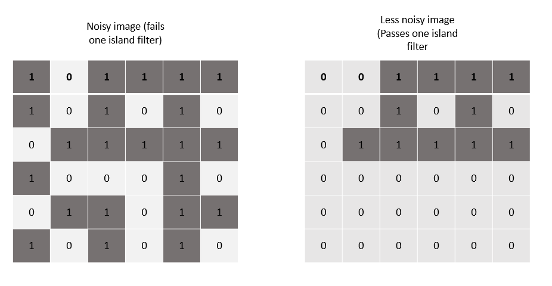

[^1]: For each vector, we have a specified dot product between it and each other vector. By taking the cosine inverse of that dot product, we have a certain angle being specified. Taking the example of 2 vectors, lets say we have vector A and vector B, with the angle between them being specified as 45 degrees (∠AB = 45)

    In such an example, we are able to put both vectors in the same 2D plane and satisfy the conditions.

    Now adding in a third vector C, with ∠AC = 50 and ∠BC = 60. In general we would need 3 dimensions for A, B and C to satisfy all angle requrements (If ∠AC != ∠AB + ∠BC)

    In the case where we tried adding vector C with ∠AC = 10 and ∠BC = 5, the system of equations would not be solvable

    Extending the above example, if we added in a vector D with ∠AD, ∠BD and ∠CD being specified, we would need 4 dimensions if the equation is solvable. Hence for 7 vectors, we would need 7 dimensions in general to perfectly satisfy the angle requirements

[^2]: Note that this method quickly explodes. Number of computations is proportional to 2^(Size of binary grid)^2 without any filters

[^3]: This means the NCC score between every image is less than 1. This filter is also how we find the 7 translationally unique squares for the brute force approach 
