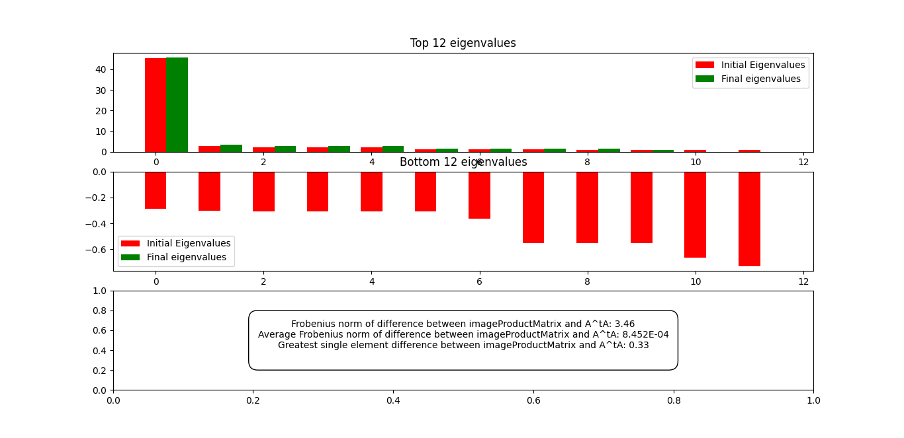
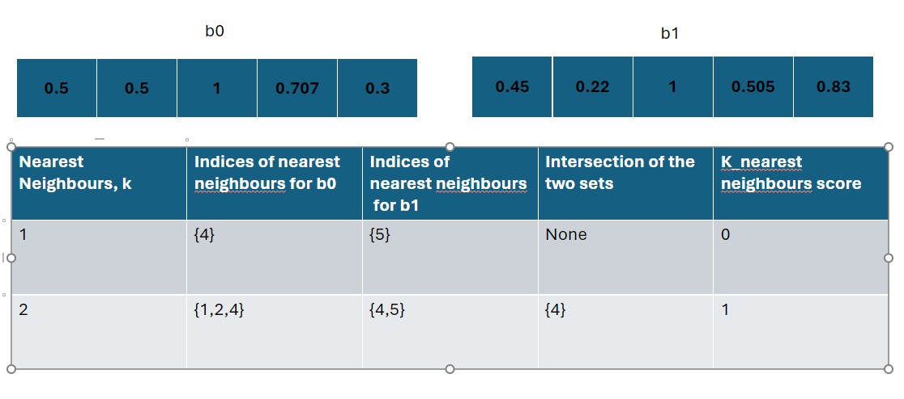

# Plotted Graphs
The following will be a detailed explanation on the graphs plotted in GraphEstimates.py and the metrics we use to detect any trends between different data distributions.

## Plot Eigenvalues
Matrix $G$ contains the vectors that embed the $n$ images, where each column of the matrix has an individual vector with $dim(d)$.

We used our rank reduction algorithm *Pencorr.m* to reduce the rank and turn Matrix $G$ **positive semi definite** (PSD) by removing the negative eigenvalues from Matrix $G$, while also ensuring that it remains a **correlation matrix** (Diagonals have value equal to 1), and ensuring that the **Fronbenius Norm** of $|G-G^{\prime}|$ is minimised (in order to get the nearest correlation matrix). 

 

For example, using a 64 by 64 matrix, we will be able quantify the error between the eigenvalues when we run the code through it. We do this by plotting the top **12** eigenvalues and the bottom **12** eigenvalues and visualing them using the bar graphs shown below (The second graph has no green rectangles as all the negative eigenvalues have already been zeroed).

 

As seen above, the eigenvalues as seen in graph 1 tend to be quite close together, insinuating that there is minimal changes in the eigenvalues, which fits with our theory that the Frobenius Norm is minimized. The second graph visualises the potential change in zeroing the negative eigenvalues and is another indicator of how much the Frobenius Norm changes.  

## K_neighbour score
For example, given a population of 64 images, we select a subset of 21 images, where 1 of them will taken out and chosen as the **testing image**, and the 20 remaining images will be the **sample subset**.

Let $x$ be the vector embedding of the testing image, and $b$ is the vector representing the image product (currently only NCC) of the testing image and the images in the sample subset.  

We can define a new vector $b_1$, where $b_1$ is the dot product of $x_{special}$ and the vectors representing the images in the sample subset. 

The highest values in vectors $b_0$ and $b_1$ represent the k images that are closest to the testing image, and their indices will be placed in sets $c_0$ and $c_1$. The k_neighbour score is represented by the number of elements in the intersection between $c_0$ and $c_1$. The full diagram is illustrated in the example below. 

When we use Pencorr.m to constrain the rank of the vector $x_{special}$, the k nearest neighbours score will vary, and we can analyse the trend of the k nearest neighbours score. This allows us to determine a specific rank where the dimension of $x_{special}$ can be reduced to.
